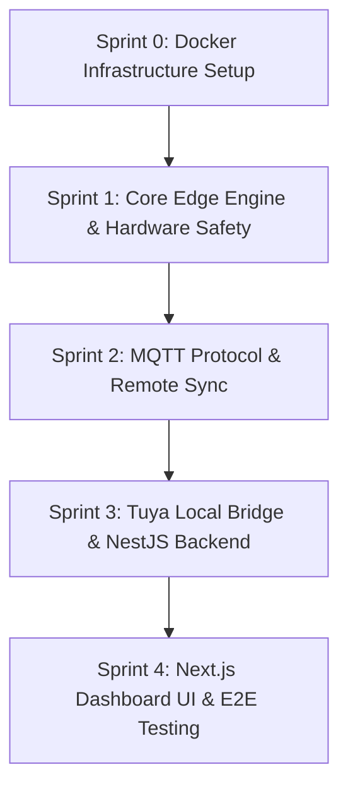

# 🌿 Aeroponics Enterprise — Master Planning Context

> **Vai trò tài liệu này:** Đây là nguồn sự thật duy nhất (Single Source of Truth) cho toàn bộ kế hoạch triển khai dự án Aeroponics Enterprise. Mọi Agent thực thi phải đọc tài liệu này trước khi bắt đầu bất kỳ Sprint nào.

---

## 1. MỤC TIÊU KỸ THUẬT TỔNG QUÁT

Xây dựng hệ thống khí canh (Aeroponics) cấp doanh nghiệp (Enterprise-grade) với các đặc tính cốt lõi:

| Đặc tính | Mô tả |
|---|---|
| **Độ tin cậy phần cứng** | Chống glitch GPIO lúc boot, NVS wear-levelling, RTC DS3231 fallback |
| **Điều khiển từ xa** | MQTT over TLS, LWT heartbeat 10s, remote config sync |
| **Quan sát thời gian thực** | WebSocket push từ NestJS → Next.js Dashboard, TimescaleDB time-series |
| **Tích hợp cảm biến** | Tuya PH-W218 8-in-1 water quality sensor qua Local Key bridge |
| **Khả năng mở rộng** | 4 Relay độc lập (FreeRTOS Task), profile Ngày/Đêm riêng biệt |
| **Bảo mật** | MQTT Authentication, JWT API, Docker network isolation |

### Bài toán nghiệp vụ cốt lõi

Hệ thống phải phân biệt và điều phối chính xác 2 chế độ hoạt động của 4 vòi phun khí canh:

- **Ban Ngày (Day Mode):** Phun 30s → Cooldown N phút → lặp lại (khoảng 12:00 – 18:00 UTC+7)
- **Ban Đêm (Night Mode):** Phun 30s → Cooldown M phút → lặp lại (khoảng 18:00 – 06:00 UTC+7)

Việc phân biệt Ngày/Đêm phải hoạt động **ngay cả khi mất Wi-Fi** (nhờ RTC DS3231) và phải **không bao giờ để rễ khô** (fail-safe relay-off khi firmware crash).

---

## 2. TECH STACK CỐT LÕI

### 2.1 Edge / Firmware Layer

| Thành phần | Công nghệ | Version |
|---|---|---|
| **MCU** | ESP32-S3 (Dual-core Xtensa LX7, 512KB SRAM) | — |
| **RTOS** | FreeRTOS (tích hợp trong ESP-IDF / Arduino core) | ESP-IDF v5.x |
| **Build System** | PlatformIO | ≥ 6.x |
| **Framework** | Arduino framework cho ESP32 | espressif32 ≥ 6.x |
| **NVS Storage** | ESP-IDF NVS (Non-Volatile Storage) API | built-in |
| **RTC Driver** | RTClib (Adafruit) cho DS3231 qua I2C | ≥ 2.x |
| **MQTT Client** | PubSubClient hoặc AsyncMqttClient | ≥ 2.8 |
| **JSON** | ArduinoJson | ≥ 7.x |
| **NTP** | ESP32 configTime / SNTP | built-in |
| **Watchdog** | ESP32 Task Watchdog Timer (TWDT) | built-in |
| **I2C** | Wire library | built-in |

### 2.2 Infrastructure Layer

| Thành phần | Công nghệ | Version |
|---|---|---|
| **MQTT Broker** | Eclipse Mosquitto | ≥ 2.0 |
| **Container** | Docker + Docker Compose | ≥ 24.x |
| **Database** | TimescaleDB (extension trên PostgreSQL) | PG 15 + TS 2.x |
| **Message Queue** | (Optional Sprint 3+) Redis pub/sub | ≥ 7.x |

### 2.3 Backend Layer

| Thành phần | Công nghệ | Version |
|---|---|---|
| **Runtime** | Node.js | ≥ 20 LTS |
| **Framework** | NestJS | ≥ 10.x |
| **Language** | TypeScript | ≥ 5.x |
| **ORM** | TypeORM | ≥ 0.3.x |
| **WebSocket** | NestJS Gateway (`@nestjs/websockets` + Socket.IO) | — |
| **Auth** | JWT + Passport.js | — |
| **Validation** | class-validator + class-transformer | — |

### 2.4 Tuya Bridge Layer

| Thành phần | Công nghệ | Version |
|---|---|---|
| **Runtime** | Node.js | ≥ 20 LTS |
| **Protocol** | Tuya Local Key (UDP Discovery + TCP AES-128-ECB) | — |
| **Library** | `tuyapi` | ≥ 7.x |
| **MQTT Publisher** | `mqtt` (npm package) | ≥ 5.x |

### 2.5 Frontend Layer

| Thành phần | Công nghệ | Version |
|---|---|---|
| **Framework** | Next.js | 14 hoặc 15 App Router |
| **Language** | TypeScript | ≥ 5.x |
| **UI Components** | shadcn/ui + Radix UI | — |
| **Styling** | Tailwind CSS | ≥ 3.x |
| **Charts** | Recharts hoặc Chart.js | — |
| **Real-time** | Socket.IO Client | — |
| **State Management** | Zustand | ≥ 4.x |
| **HTTP Client** | Axios | ≥ 1.x |

---

## 3. QUY TẮC VIẾT CODE TOÀN CỤC (Global Coding Conventions)

> **Quy tắc vàng:** Mọi Agent thực thi PHẢI tuân theo toàn bộ các quy tắc dưới đây. Không có ngoại lệ.

### 3.1 Kiến Trúc Tổng Thể

- **Clean Architecture** áp dụng cho tất cả các layer Backend và Frontend.
- Phân tầng rõ ràng: `Infrastructure → Domain/Core → Application → Presentation`.
- **Dependency Inversion:** Tầng trên chỉ phụ thuộc vào Interface, không phụ thuộc vào Implementation cụ thể.
- **Single Responsibility Principle (SRP):** Mỗi module/class/hàm chỉ làm đúng một việc.

### 3.2 Quy Tắc Đặt Tên

**Firmware (C++):**
```
- Hàm/Phương thức: camelCase              (vd: initRelayPins, syncRtcFromNtp)
- Biến thành viên: snake_case với prefix_ (vd: spray_duration_s, is_night_mode)
- Hằng số/Macro: SCREAMING_SNAKE_CASE    (vd: RELAY_PIN_1, NVS_KEY_SPRAY_DAY)
- Class/Struct: PascalCase               (vd: RelayController, NvsStorage)
- File Header: lowercase_underscore.h    (vd: relay_controller.h)
- File Source: lowercase_underscore.cpp  (vd: relay_controller.cpp)
```

**Backend TypeScript (NestJS):**
```
- Class/Interface/Enum: PascalCase       (vd: RelayService, CreateRelayDto)
- Hàm/Phương thức: camelCase            (vd: getRelayStatus, updateSchedule)
- Biến/Tham số: camelCase               (vd: relayId, sprayDuration)
- Hằng số module: UPPER_SNAKE_CASE      (vd: MQTT_TOPIC_PREFIX)
- File: kebab-case.suffix.ts            (vd: relay.service.ts, relay.controller.ts)
```

**Frontend TypeScript (Next.js):**
```
- Component: PascalCase                 (vd: RelayCard, ScheduleForm)
- Hook: camelCase prefix "use"          (vd: useRelayStatus, useScheduleForm)
- Constant: UPPER_SNAKE_CASE            (vd: SOCKET_EVENTS)
- File: kebab-case.tsx hoặc PascalCase.tsx
```

### 3.3 Quy Tắc Xử Lý Lỗi (Error Handling)

**Firmware (C++):**
- **KHÔNG bao giờ** để hàm quan trọng `void` và bỏ qua return error.
- Tất cả hàm driver (`nvs_*`, `rtc_*`, `mqtt_*`) phải trả về `bool` hoặc `esp_err_t`.
- Khi NVS write/read thất bại → log error qua Serial + fallback về giá trị mặc định an toàn.
- Khi MQTT disconnect → trigger reconnect với **Exponential Backoff** (1s → 2s → 4s → max 60s).
- Relay state mặc định luôn là `OFF` (LOW signal = không kích relay Active HIGH).

**Backend TypeScript:**
- Dùng NestJS `ExceptionFilter` global để bắt tất cả lỗi.
- Không bao giờ để `console.log` trong production code → dùng NestJS `Logger`.
- Tất cả DB operation phải bọc trong `try/catch` và throw `InternalServerErrorException` có message rõ ràng.
- DTO validation bắt buộc với `class-validator` cho mọi endpoint.

**Frontend TypeScript:**
- Tất cả API call dùng `try/catch` + toast notification cho user.
- Socket.IO connection error phải hiện UI indicator rõ ràng (không âm thầm fail).

### 3.4 Quy Tắc Bảo Mật (Security Rules)

- **KHÔNG** hardcode credential (WiFi SSID/Password, MQTT user/pass, JWT secret) trong source code.
- Firmware: Đọc credential từ NVS sau khi provisioning hoặc từ `secrets.h` (trong `.gitignore`).
- Backend: Đọc credential từ biến môi trường (`.env`), validate qua `@nestjs/config`.
- MQTT Broker: Bắt buộc Authentication. Anonymous access = `false`.
- Docker: Các service không cần expose ra ngoài thì chỉ dùng internal network.

### 3.5 Quy Tắc Git & Commit

```
- Conventional Commits: feat:, fix:, chore:, docs:, refactor:
- Branch per sprint: sprint/1-core-edge, sprint/2-mqtt, sprint/3-backend, sprint/4-ui
- Mỗi PR phải có description rõ "What" và "Why"
- Không merge PR khi còn TODO/FIXME chưa giải quyết
```

### 3.6 Quy Tắc Tài Liệu

- Mọi hàm public trong Firmware và Backend phải có comment JSDoc / Doxygen ngắn gọn.
- Mọi MQTT topic mới phải cập nhật vào `docs/MQTT_TOPICS.md` ngay khi tạo.
- Mọi DP (Data Point) của Tuya mới phải cập nhật vào `docs/TUYA_PH_W218_SPEC.md`.

---

## 4. CẤU TRÚC SPRINT ROADMAP

```
Sprint 0  →  Sprint 1  →  Sprint 2  →  Sprint 3  →  Sprint 4
Docker        Firmware      MQTT          Backend       UI & QA
Infra         Core Engine   Protocol      NestJS +      Next.js +
Setup         & HW Safety   + Infra       Tuya Bridge   E2E Tests
```



| Sprint | File kế hoạch | Trạng thái |
|---|---|---|
| Sprint 0: Docker Infrastructure Setup | [sprint_0.md](./sprint_0.md) | 🟡 Sẵn sàng thực thi |
| Sprint 1: Core Edge Engine & Hardware Fail-safe | [sprint_1.md](./sprint_1.md) | 🔵 Chờ Sprint 0 hoàn thành |
| Sprint 2: MQTT Protocol & Remote Control | [sprint_2.md](./sprint_2.md) | 🔵 Chờ Sprint 1 hoàn thành |
| Sprint 3: Tuya Local Bridge & NestJS Backend | [sprint_3.md](./sprint_3.md) | 🔵 Chờ Sprint 2 hoàn thành |
| Sprint 4: Next.js Dashboard UI & E2E Testing | [sprint_4.md](./sprint_4.md) | 🔵 Chờ Sprint 3 hoàn thành |

---

## 5. RÀNG BUỘC PHẦN CỨNG (Hardware Constraints)

> Agent thực thi firmware **BẮT BUỘC** nắm rõ các ràng buộc vật lý này.

| Ràng buộc | Chi tiết |
|---|---|
| **Relay Logic** | Active HIGH (tín hiệu HIGH = relay ON). Pull-down 10kΩ vật lý tại chân Signal. |
| **Boot Safety** | GPIO phải được set `LOW` **trước** `pinMode(OUTPUT)` để tránh glitch kích relay lúc boot. |
| **RTC Module** | DS3231 kết nối I2C. SDA = GPIO 21, SCL = GPIO 22 (kiểm tra lại theo sơ đồ thực tế). |
| **NVS Write Policy** | Chỉ ghi NVS khi nhận MQTT command thay đổi config. KHÔNG ghi NVS định kỳ. |
| **Watchdog** | Task Watchdog phải được feed đúng hạn trong vòng lặp của mỗi FreeRTOS Task. |
| **Stack Size** | Mỗi FreeRTOS Task cấp phát tối thiểu 4096 bytes stack, relay task 8192 bytes. |

---

*Tài liệu này được khởi tạo bởi Baseline Agent vào ngày 2026-07-30.*
*Mọi thay đổi về kiến trúc phải được phê duyệt và cập nhật tại đây trước khi thực thi.*
