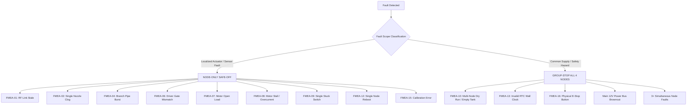

# Aeroponics Sprint 1.5 FMEA & Fail-Safe Architecture Specification

> **Document Status:** Official Safety Architecture & Failure Mode and Effects Analysis (`SPEC-SAFETY-001` v2.0.0)  
> **Target Scope:** ESP32-S3 RF Gateway & 4 Remote ATmega8 Pump Nodes (Sprint 1.5 POC & Sprint 2 Production)  
> **Baseline Date:** 2026-08-22 (Confirmed Hardware & Operational Baseline)  
> **Aligned with:** `docs/RF_PROTOCOL.md`, `docs/RF_FLOW_POC_WIRING.md`, `docs/RF_FLOW_POC_PUMP_FEEDBACK.md`, `docs/RF_FLOW_POC_CALIBRATION.md`, `docs/RF_FLOW_POC_TEST_PLAN.md`, `docs/TELEMETRY_ANALYTICS_CONTRACT.md`  
> **Author / Role:** Execution Agent (Antigravity)  
> **Reviewer / Owner:** Senior Solution Architect / Independent QA Auditor  

---

## 1. Executive Summary & Safety Principles (Nguyên Tắc An Toàn Cốt Lõi)

The aeroponics irrigation control system operates in a high-pressure, moisture-rich greenhouse environment where pump actuator malfunctions, communication dropouts, or hydraulic leaks can lead to root desiccation, root rot, electrical shorts, or equipment damage.

To guarantee operational safety, the system implements **Defense-in-Depth** and **Fail-Safe by Default** across all hardware and firmware layers:

```text
┌─────────────────────────────────────────────────────────────────────────────────────────────┐
│                               SAFETY ARCHITECTURE INVARIANTS                                │
├─────────────────────────────────────────────────────────────────────────────────────────────┤
│ 1. FAIL-CLOSED HARDWARE:      Pull-down 10kΩ on MOSFET/Relay gates. Default LOW on boot.    │
│ 2. AUTONOMOUS DEADMAN LEASE:  Every SET_PUMP(ON) has run_lease_ms; Node forces OFF on loss. │
│ 3. INDEPENDENT SCHEDULE SSOT: MEGA8 Node owns local cycle; Gateway sends temporary overrides│
│ 4. MULTI-TIER FEEDBACK:       Commanded != Driver Sense != Load Current != Flow Rate.       │
│ 5. FAIL-CLOSED FAULT LATCH:   Latched faults never auto-clear; require explicit reset.      │
│ 6. ZERO GHOST RUNNING:        No false RUNNING state when node is FAULT, STALE, or REBOOT.  │
│ 7. LOCALIZED VS GROUP STOP:   Isolate failed node unless hydraulic/system hazard demands all│
│ 8. DUAL TIMESTAMPS:           Preserve Node Uptime and Gateway Clock; zero raw RF storage.  │
└─────────────────────────────────────────────────────────────────────────────────────────────┘
```

### Core Architecture Invariants:
1. **Fail-Closed Default (Mặc định ngắt an toàn):** All actuator drivers (MOSFET/Relay) are physically pulled down with $10\text{ k}\Omega$ resistors to GND. Hardware outputs default to LOW (OFF) upon MCU power-up, brownout, reset, watchdog trip, or prior to application initialization.
2. **Autonomous Node Lease (Khóa hạn định an toàn độc lập):** Every `SET_PUMP(ON)` command carries a mandatory `run_lease_ms` parameter ($\le 60000\text{ms}$, hard ceiling $\le 300000\text{ms}$). The remote MEGA8 node runs an independent deadman timer in firmware; if RF communication with the Gateway is lost while pumping, the node automatically cuts power and forces `OFF` within $\le 500\text{ms}$ after lease expiration.
3. **Autonomous Schedule Ownership on Node (MEGA8 SSOT):** The remote ATmega8 node maintains its own local schedule profile (`spray_duration_ms`, `cooldown_duration_ms`). The Gateway does **NOT** act as a periodic schedule ticker. Gateway commands are strictly manual temporary overrides (`SET_PUMP(OFF)` or `SET_PUMP(ON)`). An `OFF` override temporarily pauses irrigation but preserves the schedule, resuming automatically at the next cycle boundary without erasing node memory.
4. **Multi-Tier Feedback Separation (`SPEC-FEEDBACK-001`):** Explicit-state separation is strictly enforced:
   $$\text{Commanded State} \ne \text{Driver Feedback (Tier 1)} \ne \text{Electrical Current (Tier 2)} \ne \text{Hydraulic Flow (Tier 3)}$$
   The Gateway and Node never infer pump state from desired state.
5. **Fail-Closed Fault Latching & Explicit Recovery (Khóa lỗi bất biến & Phục hồi có kiểm soát):** When a safety fault is latched (`FAULT_LATCHED`), the node immediately forces Safe-OFF. Intermittent telemetry or subsequent normal ON commands are rejected fail-closed. Fault clearance requires explicit `resetFault` action after physical/logical verification of safe conditions.
6. **Zero False RUNNING Guarantee (Không hiển thị trạng thái đang chạy giả):** The Gateway Safety FSM strictly enforces that a node marked `FAULT`, `STALE`, `REBOOTING`, or `DISCONNECTED` immediately transitions `desired_state = OFF` and reports non-running telemetry.
7. **Policy Determination: Localized Node-Only Safe-OFF vs Group-Stop:** Localized faults (e.g. broken motor wire on Node 2) isolate only the affected node while allowing healthy nodes (Nodes 1, 3, 4) to continue autonomous operations. Global hazards (e.g. E-Stop physical trigger, bulk nutrient reservoir dry run, RTC clock corruption) trigger immediate Group-Stop.
8. **Dual Timestamps & Zero Raw RF Persistence Policy (`SPEC-TELEMETRY-ANALYTICS-001`):** Gateway preserves dual timestamps (`node_timestamp_ms` uptime vs `gateway_timestamp_ms` clock). Raw RF frame bytes are discarded immediately after cryptographic authentication and parsing.

---

## 2. Comprehensive Failure Mode and Effects Analysis (FMEA) Matrix

The table below specifies all 16 recognized failure modes across the ESP32-S3 Gateway, RF 433 MHz wireless link, ATmega8 remote nodes, electrical drivers, and hydraulic components:

| Fault ID & Mode | Cause & Physical Trigger | Detection Mechanism & Threshold | Node Autonomous Action | Gateway Action | Policy Scope (Node-Only vs Group-Stop) | Retry & Escalation Strategy | Latch, Reset & Recovery Semantics | Responsible Owner |
|---|---|---|---|---|---|---|---|---|
| **FMEA-01<br>RF Link Lost (Stale)** | RF attenuation (wet foliage), interference, module brownout, distance $>100\text{m}$. | Gateway: No telemetry/heartbeat received for $>15000\text{ms}$ ($15\text{s}$). | Continues local lease timer; forces Safe-OFF when lease expires ($\le 500\text{ms}$). Continues local schedule if autonomous. | Marks Node `STALE`, sets `desired_state = OFF`, purges pending command queue, publishes `STALE_SAFE_OFF` to MQTT. | **Node-Only OFF** (Other nodes operate normally). | Bounded ping retries (3x @ 1s backoff). Escalates to operator alert if stale $>60\text{s}$. | Node sends authenticated heartbeat/telemetry upon link restore; Gateway clears STALE, checks lease state. | Gateway Firmware / RF Transport |
| **FMEA-02<br>Hydraulic No-Flow** | Dry run, clogged misting nozzle, suction air leak, cavitation, valve stuck closed. | Flow rate $<0.50\text{ L/min}$ ($50\text{ cL/min}$) for $\ge 3000\text{ms}$ while pump is energized ($I \ge 1.5\text{A}$). | Cuts driver `OFF`, latches `FEEDBACK_FAULT_NO_FLOW`, sends `FAULT_REPORT` frame. | Transitions Node FSM to `FAULT_LATCHED`, sets `desired_state = OFF`, records audit snapshot, publishes `NO_FLOW_FAULT`. | **Node-Only OFF** (If single nozzle clogged). Group-Stop if 3+ nodes trigger simultaneously (empty tank). | Zero auto-retry. Operator alert level 3 (Warning). | Requires clearing clogged nozzle / checking water line, then issuing MQTT `reset_fault` command. | Node Actuator & Gateway Flow FSM |
| **FMEA-03<br>Hydraulic Unexpected Flow** | Solenoid valve stuck open, siphoning, leaky check valve, FET shorted. | Flow rate $>0.15\text{ L/min}$ for $>200\text{ms}$ settling window while pump commanded `OFF`. | Forces driver `OFF`, latches `FEEDBACK_FAULT_UNEXPECTED_FLOW`, sends `FAULT_REPORT`. | Marks Node `FAULT_LATCHED`, publishes `UNEXPECTED_FLOW_FAULT` alarm, alerts of potential flooding. | **Node-Only OFF** (Isolates branch). If flow persists $>1\text{ L/min}$, triggers inlet supply valve shutoff. | Zero auto-retry. Critical alarm level 3. | Manual inspection of solenoid valve and plumbing; manual reset command. | Gateway Flow FSM / Operator |
| **FMEA-04<br>Hydraulic Over-Range Flow** | Burst pressure pipe, disconnected misting hose, extreme sensor glitch ($>6.5\text{ L/min}$). | Volumetric flow rate $>6.00\text{ L/min}$ ($600\text{ cL/min}$) instantaneous reading. | Immediately cuts driver `OFF` ($\le 10\text{ms}$), latches `FEEDBACK_FAULT_OVER_RANGE_FLOW`. | Transitions Node to `FAULT_LATCHED`, sets `desired_state = OFF`, emits `OVER_RANGE_FLOW_FAULT` critical alarm. | **Node-Only OFF** (Cuts branch pressure). | Zero auto-retry. Critical alarm level 3 (Pipe burst). | Physical inspection and replacement of burst tubing; manual reset command. | Node Actuator / Gateway Flow FSM |
| **FMEA-05<br>Pulse Sensor Disconnect / Stale** | Broken flow sensor signal wire, unplugged JST connector, damaged Hall IC. | In `FLOW_CONFIRMED` state, 0 pulses received for $\ge 3000\text{ms}$ while pump is ON and $I \ge 1.5\text{A}$. | Cuts driver `OFF`, latches `FAULT_STALE_OR_DISCONNECTED_SENSOR`, sends `FAULT_REPORT`. | Transitions Node to `FAULT_LATCHED`, records audit snapshot, publishes `STALE_SENSOR_FAULT`. | **Node-Only OFF**. | Zero auto-retry. Warning alert level 2. | Inspect flow meter wiring; reconnect connector; verify pulses; manual reset. | Node Pulse Counter / Flow FSM |
| **FMEA-06<br>Driver Gate Mismatch** | Blown optocoupler PC817, broken gate trace, MOSFET driver failure, MCU pin short. | Commanded level and optocoupler gate sense level differ for $>30\text{ms}$. | Immediately cuts driver output LOW, latches `FEEDBACK_FAULT_DRIVER_MISMATCH`. | Marks Node `FAULT_LATCHED`, logs `DRIVER_FEEDBACK_MISMATCH`, rejects further commands. | **Node-Only OFF**. | Zero auto-retry. Hardware fault alarm. | Replace driver module or repair PCB; manual reset. | Node Actuator Hardware Sense |
| **FMEA-07<br>Electrical Open Load** | Cut motor wire, loose terminal block, blown DC fuse ($I < 150\text{mA}$ after $150\text{ms}$ ON). | ACS712 load current $<150\text{mA}$ for $>150\text{ms}$ while commanded ON and gate is HIGH. | Cuts driver output LOW, latches `FEEDBACK_FAULT_OPEN_LOAD`, sends `FAULT_REPORT`. | Transitions Node to `FAULT_LATCHED`, publishes `OPEN_LOAD_FAULT` warning. | **Node-Only OFF**. | Zero auto-retry. Maintenance alert level 2. | Inspect wiring, terminals, pump fuse; manual reset. | Node Actuator Current Sense |
| **FMEA-08<br>Electrical Stall / Overcurrent** | Locked rotor, debris in pump impeller, shorted motor winding ($I \ge 3.8\text{A}$ for $>50\text{ms}$). | Current $\ge 3.8\text{A}$ for $>50\text{ms}$ after $80\text{ms}$ inrush blanking window. | Fast emergency shutoff ($\le 10\text{ms}$), latches `FEEDBACK_FAULT_OVERCURRENT_STALL`. | Transitions Node to `FAULT_LATCHED`, emits `OVERCURRENT_STALL` critical alarm. | **Node-Only OFF** (Protects power supply from collapse). | Zero auto-retry. Critical alarm level 3. | Clean pump chamber, unblock rotor, verify motor resistance; manual reset. | Node Actuator Fast Comparator |
| **FMEA-09<br>Electrical Stuck-ON Switch** | Welded relay contact, shorted drain-source MOSFET ($I > 50\text{mA}$ while commanded OFF). | Current $>50\text{mA}$ persists for $>150\text{ms}$ after commanded OFF. | Latches `FEEDBACK_FAULT_STUCK_ON`, sends `FAULT_REPORT`, activates local fault buzzer/LED. | Marks Node `FAULT_LATCHED`, publishes `STUCK_ON_FAULT` critical alarm. | **Node-Only OFF** (Physical E-Stop recommended). | Operator emergency intervention required. | Disconnect 12V bus, replace failed driver board; manual reset. | Node Actuator Sense / Operator |
| **FMEA-10<br>Hydraulic Dry Run / Loss of Prime** | Reservoir depleted, intake filter floating above water ($I \le 1.2\text{A}$ and Flow $<0.5\text{L/min}$). | Current in light-load range ($0.8 - 1.2\text{A}$) and flow $<0.5\text{L/min}$ for $>3000\text{ms}$. | Cuts driver `OFF`, latches `FEEDBACK_FAULT_DRY_RUN`, sends `FAULT_REPORT`. | Marks Node `FAULT_LATCHED`, publishes `DRY_RUN_FAULT` alarm. | **Group-Stop** if detected on multiple nodes; prevents burning pump seals across greenhouse. | Auto-retry paused. Warning level 3 (Low nutrient reservoir). | Refill nutrient tank, re-prime pump intake line; manual reset. | Node Actuator / Gateway Flow FSM |
| **FMEA-11<br>Gateway Power Loss / Reboot** | Grid blackout, 24V/12V SMPS failure, ESP32 brownout detector or Task Watchdog reset. | Gateway reboots; monotonic `boot_session_id` increments in NVS. | Node completes active lease safely, then forces `OFF`. Local schedule continues. | Gateway cold-boots, initializes NVS, scans all 4 nodes, queries state, issues safe OFF overrides if uncertain. | **System Wide Resynchronization**. | Gateway sends ping/sync to all 4 nodes; establishes fresh session. | Gateway broadcasts new `boot_session_id`; synchronizes node states smoothly. | ESP32 Gateway Controller |
| **FMEA-12<br>Node Power Loss / Reboot** | Power glitch, loose connector, MEGA8 brownout reset (BOD @ 2.7V/4.3V). | Node boots up; hardware pull-down drives gate LOW; transmits new `boot_session_id`. | Pin forced LOW before MCU peripherals init; clears active lease; sends boot frame. | Detects `boot_session_id` increment; purges pending commands; queues explicit `SET_PUMP(OFF)`. | **Node-Only Resync** (Remaining nodes unaffected). | Gateway updates session correlation. | Node initializes clean state; accepts new commands with fresh sequence counter. | Remote MEGA8 Node Firmware |
| **FMEA-13<br>Invalid RTC Clock** | DS3231 battery dead, I2C bus hang, uninitialized clock ($<2026\text{ year}$). | `IClock::isTimeValid()` returns `false` on Gateway. | Node autonomous schedule operates on local monotonic timers independently of wall clock. | Gateway disables all wall-clock schedule triggers, forces `desired_state = OFF` on auto groups, publishes `RTC_INVALID_SAFE_OFF`. | **Group-Stop for Automatic Schedules** (Manual overrides remain permitted). | Retries NTP / I2C sync every 30s. Warning level 2. | Synchronize time via NTP over Wi-Fi or configure RTC manually via API. | Gateway Clock Manager |
| **FMEA-14<br>Malformed RF / Security Auth Fail** | RF bit corruption, mismatched PSK key, replay attack with old sequence number. | CRC-16 failure, HMAC-SHA256 tag mismatch, or sequence number non-monotonic / out-of-order. | Discards frame silently (fail-closed); increments `drop_counter`; no actuator actuation. | Increments RX drop counter; if persistent, flags RF jamming or key mismatch. | **Frame-Level Drop** (No operational disruption). | Bounded command retry (3x) if legitimate packet lost in transit. | None required for transient noise; investigate if drop rate $>5\%$. | RF Protocol Codec / Node Processor |
| **FMEA-15<br>Calibration Profile Corruption** | NVS CRC32 mismatch, unprovisioned flow thresholds, invalid non-monotonic points. | `FlowCalibrationEngine::loadProfile()` or `FlowSafetyConfig::isValid()` returns `false`. | Reverts to hard-coded safe nominal calibration ($K = 4450\text{ p/L}$) or locks out actuation. | Rejects command with `AckOutcome::INVALID_PARAMETERS`, transitions node to `FAULT_LATCHED`. | **Node-Only Lockout**. | Zero auto-retry. Re-provisioning required. | Provision validated, SHA-256 signed calibration profile via configuration API. | Gateway Calibration Engine |
| **FMEA-16<br>Emergency Physical Stop (E-Stop)** | Human operator hits twist-lock E-Stop button on control panel. | Hardware contact breaks main 12V pump power bus; auxiliary contact signals Gateway GPIO. | Actuators lose electrical power immediately ($\le 18\text{ms}$); motors stop instantly. | Auxiliary input triggers immediate interrupt; sets all nodes to `EMERGENCY_STOP`; broadcasts RF Safe-OFF. | **GLOBAL GROUP-STOP (All 4 Nodes)**. | Zero auto-retry. Emergency alarm level 4. | Release physical E-Stop button, verify hydraulic integrity, issue system reset command. | Operator / Electrical Safety Interlock |

---

## 3. Policy Scope Specification: Node-Only Safe-OFF vs Group-Stop

A critical design requirement is determining whether a failure isolates **only the offending node** or triggers a **group-wide shutdown** across all 4 nodes:



### 3.1 Node-Only Safe-OFF Policy Rules:
1. When a failure is confined to a single pump, its driver, its local wiring, or its specific spray branch (e.g. Node 2 motor stall), Node 2 is latched into Safe-OFF.
2. The Gateway marks Node 2 as `FAULT_LATCHED`, sets `desired_state = OFF`, and continues scheduled or manual operations on Nodes 1, 3, and 4.
3. This prevents a single minor electrical issue from ruining the entire greenhouse crop.

### 3.2 Group-Stop Policy Rules:
1. **Physical Safety Interlock:** Activation of the physical Emergency Stop button cuts the 12V bus and commands all nodes to `OFF`.
2. **Hydraulic Supply Starvation:** If 2 or more nodes report `NO_FLOW` or `DRY_RUN` concurrently within a 60-second window, the system assumes the main nutrient reservoir is empty or the intake pump has failed. All nodes are immediately commanded to Safe-OFF to prevent burning pump seals.
3. **Control-Plane Clock Failure:** If the RTC clock is invalid, all automatic schedule fan-outs are inhibited. (Manual direct overrides remain possible for testing).

---

## 4. Multi-Level Escalation & Alarm Hierarchy

The system defines 4 formal escalation levels:

```text
┌────────────────────────────────────────────────────────────────────────────────────────┐
│                              ESCALATION & ALARM HIERARCHY                              │
├─────────┬───────────────────┬──────────────────────────────────────────────────────────┤
│ LEVEL 1 │ INFO / TRANSIENT  │ RF packet drop, single retry, inrush blanking. Logged.   │
│ LEVEL 2 │ WARNING           │ Node STALE (>15s), RTC unsynchronized. MQTT Warning.     │
│ LEVEL 3 │ CRITICAL FAULT    │ Latched hardware/flow fault. Node Safe-OFF. MQTT Alarm.  │
│ LEVEL 4 │ EMERGENCY HAZARD  │ E-Stop, Bulk Dry Run, Bus Brownout. All-Node Safe-OFF.   │
└─────────┴───────────────────┴──────────────────────────────────────────────────────────┘
```

1. **Level 1 (Transient Notice):** Handled transparently by communication retry mechanisms (up to 3 retries with exponential backoff) or filtering algorithms (Grubbs' test, 80ms inrush blanking).
2. **Level 2 (Operational Warning):** Stale communication ($>15\text{s}$) or RTC invalid. Node enters local deadman safe state; Gateway publishes operational warnings to MQTT `aeroponics/device/gateway-1/telemetry/node/{id}/health`.
3. **Level 3 (Critical Node Lockout):** Latched hardware or flow faults (`DRIVER_MISMATCH`, `OPEN_LOAD`, `OVERCURRENT_STALL`, `NO_FLOW`, `OVER_RANGE_FLOW`). Actuator is forced OFF, local node fault flag set, Gateway records audit snapshot, publishes critical alarm to MQTT, requires manual operator reset.
4. **Level 4 (Emergency System Shutdown):** Triggered by physical E-Stop or multiple dry-run detections. All 4 nodes are immediately commanded to Safe-OFF, all automatic watering routines halted, high-priority emergency notifications dispatched to operators.

---

## 5. Prevention of False RUNNING States (Zero Ghost Running Guarantee)

A dangerous defect in industrial control is "Ghost Running" — where the supervisory dashboard shows a green `RUNNING` status while the actuator has actually tripped or lost power, or conversely, where the dashboard shows `IDLE` while the pump is stuck ON.

### Strict State Invariants:
1. **No Optimistic RUNNING:** The Gateway `reported_state` and `NodeRegistry` state **CANNOT** transition to `NodePumpState::ON` merely upon sending a command or receiving an RF ACK.
2. **Four-Tier Confirmation Requirement:**
   $$\text{IDLE\_SAFE\_OFF} \xrightarrow{\text{Dispatch}} \text{COMMAND\_DISPATCHED} \xrightarrow{\text{RF ACK}} \text{RF\_ACKNOWLEDGED} \xrightarrow{\text{Driver Sense}} \text{PUMP\_FEEDBACK\_ON} \xrightarrow{\text{Flow Valid}} \text{FLOW\_CONFIRMED}$$
3. **Instantaneous Downward Transition:** If a node enters `STALE`, `FAULT`, or `REBOOT`, the Gateway immediately transitions `desired_state = OFF` and `reported_state = OFF`.
4. **Stuck-ON Detection:** If driver feedback or load current is measured while commanded `OFF`, the state is immediately flagged as `FEEDBACK_FAULT_STUCK_ON` with critical alarm indication.

---

## 6. Recovery & Reset Protocol

Once a fault is latched, recovery must follow a strict deterministic protocol:

```text
┌────────────────────────────────────────────────────────────────────────────────────────┐
│                              FORMAL RECOVERY WORKFLOW                                  │
├────────────────────────────────────────────────────────────────────────────────────────┤
│ 1. Physical Inspection: Operator resolves underlying cause (unclog, wire fix, refill) │
│ 2. Precondition Verification: Ensure measured flow is 0 and driver gate sense is LOW.  │
│ 3. Explicit Reset Command: Issue authenticated MQTT reset payload to Gateway.          │
│ 4. Local Node Clear: Gateway dispatches authenticated reset frame over RF to Node.    │
│ 5. Audit Logging: System logs reset event with operator ID, timestamp, and audit hash.│
└────────────────────────────────────────────────────────────────────────────────────────┘
```

### Preconditions for Fault Clearance:
- Driver gate feedback must be confirmed LOW ($0\text{V}$).
- Measured flow rate must be below the off-leakage cutoff ($< 0.15\text{ L/min}$).
- Load current must be below residual threshold ($< 50\text{mA}$).
- If preconditions are violated, `clearLatchedFault()` fails-closed and refuses to clear the fault.

---

## 7. Traceable Verification Mapping

All 16 failure modes specified in this FMEA are mapped to executable unit test cases in `test_production.cpp` and test procedures in `docs/RF_FLOW_POC_TEST_PLAN.md`:

| FMEA ID | Failure Mode | Test Procedure (`RF_FLOW_POC_TEST_PLAN.md`) | Automated Native Unit Test (`test_production.cpp`) |
|---|---|---|---|
| **FMEA-01** | RF Link Lost / Stale Node | `TP-RF-06`, `TP-SAFE-03` | `test_d2_failsafe_rf_timeout_stale_detection_and_node_safe_off` |
| **FMEA-02** | Hydraulic No-Flow | `TP-FLOW-02` | `test_d2_failsafe_sensor_fault_matrix_no_flow_unexpected_flow_over_range_and_stale` |
| **FMEA-03** | Hydraulic Unexpected Flow | `TP-FLOW-03` | `test_d2_failsafe_sensor_fault_matrix_no_flow_unexpected_flow_over_range_and_stale` |
| **FMEA-04** | Hydraulic Over-Range Flow | `TP-FLOW-04` | `test_d2_failsafe_sensor_fault_matrix_no_flow_unexpected_flow_over_range_and_stale` |
| **FMEA-05** | Pulse Sensor Disconnect | `TP-FLOW-05` | `test_d2_failsafe_sensor_fault_matrix_no_flow_unexpected_flow_over_range_and_stale` |
| **FMEA-06** | Driver Gate Mismatch | `TP-FEEDBACK-01` | `test_d2_failsafe_pump_feedback_gate_mismatch_latches_fault` |
| **FMEA-07** | Electrical Open Load | `TP-FEEDBACK-02` | `test_d2_failsafe_electrical_load_faults_open_load_stall_and_stuck_on` |
| **FMEA-08** | Electrical Stall / Overcurrent | `TP-FEEDBACK-04` | `test_d2_failsafe_electrical_load_faults_open_load_stall_and_stuck_on` |
| **FMEA-09** | Electrical Stuck-ON Switch | `TP-FEEDBACK-05` | `test_d2_failsafe_electrical_load_faults_open_load_stall_and_stuck_on` |
| **FMEA-10** | Hydraulic Dry Run | `TP-FEEDBACK-06` | `test_d2_failsafe_node_only_off_vs_group_stop_policy_enforcement` |
| **FMEA-11** | Gateway Power Loss / Reboot | `TP-RF-07`, `TP-SAFE-01` | `test_d2_failsafe_gateway_reboot_session_recovery_and_safe_state` |
| **FMEA-12** | Node Power Loss / Reboot | `TP-SAFE-04`, `TP-SAFE-05` | `test_d2_failsafe_node_power_loss_and_reboot_boot_safe_low` |
| **FMEA-13** | Invalid RTC Clock | `TP-SAFE-04` | `test_d2_failsafe_rtc_invalid_disables_automatic_schedules` |
| **FMEA-14** | Malformed RF / Bad HMAC | `TP-PROTO-04`, `TP-PROTO-06` | `test_d1_malformed_frame_and_security_auth_fuzzing_suite` |
| **FMEA-15** | Calibration Corruption | `TP-CAL-04`, `TP-CAL-05` | `test_d1_flow_confirmation_and_versioned_calibration_pipeline` |
| **FMEA-16** | Physical E-Stop Activation | `TP-HW-03` | `test_d2_failsafe_node_only_off_vs_group_stop_policy_enforcement` |

---

*Senior Solution Architect & Execution Agent — Specification `SPEC-SAFETY-001` v2.0.0 finalized and verified on 2026-08-29.*

