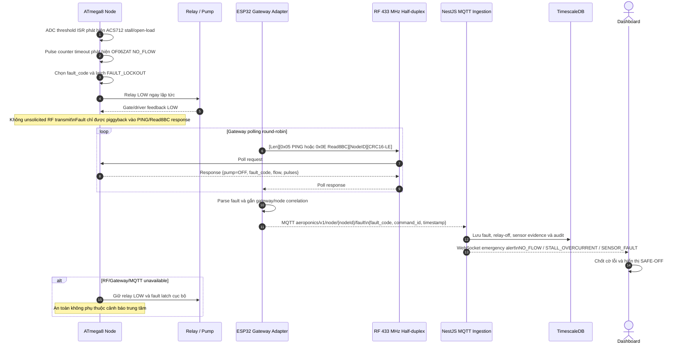

# Sơ đồ Tuần tự Luồng Nghiệp vụ Trọng yếu (E2E Critical Sequence Flows)

**Dự án:** Aeroponics Lab  
**Phiên bản:** 2.0  
**Trạng thái:** Architecture decision record, dùng làm contract triển khai

Tài liệu này chốt đúng ba luồng xương sống. ATmega8 đã được nạp sẵn; không có source và không được sửa firmware. Mọi hành vi node chưa quan sát được phải ghi là `UNKNOWN`.

## 1. Quyết định kiến trúc và trách nhiệm

### 1.1 Option C: Gateway Adapter Proxy

Có **hai miền giao thức tách biệt**, không được gọi thay thế cho nhau:

| Miền | Thành phần | Contract |
|---|---|---|
| Northbound control plane | Web UI ↔ NestJS ↔ MQTT ↔ ESP32 | JSON/MQTT production semantic: `command_id`, `run_lease_ms`, correlation, retry policy, state và audit. |
| Southbound actuator plane | ESP32 ↔ ATmega8 qua RF 433 MHz | **AGU-Aeroponics legacy SCI**: `[Length][Opcode][Params][CRC16-Modbus LE]`; không HMAC, không `boot_session_id`, không RF `sequence`, không production `command_id`. |

ESP32 là **adapter duy nhất**: nhận semantic production ở northbound, quản lý timeout/correlation/retry ở gateway, rồi chuyển thành frame **AGU-Aeroponics** southbound bằng `AguLegacyCodec`. ATmega8 chỉ được coi là thực hiện những opcode/response đã quan sát. Không được vẽ một frame HMAC production đi thẳng vào ATmega8 legacy.

> **Safety gate:** Gateway không thể gửi `PUMP_OFF` qua một liên kết RF đang đứt. Vì chưa có source và chưa xác minh firmware đã nạp, không được giả định node có local watchdog/lease timer. Nếu deployment yêu cầu Safe-OFF khi mất RF, phải có interlock phần cứng hoặc bằng chứng black-box độc lập; nếu không, admission của lệnh ON phải bị từ chối (fail-closed).

### 1.2 Southbound opcode và polling

| Opcode | Ý nghĩa |
|---|---|
| `0x05` | `PING`, gateway hỏi trạng thái node |
| `0x06` | `PUMP_ON` |
| `0x07` | `PUMP_OFF` |
| `0x0E` | Legacy `Read8BC`, đọc khối 8 byte RAM để lấy trạng thái runtime (firmware Delphi cũ) |
| `0x08` | Legacy `ReadEEP`, đọc một byte EEPROM; **không phải** `STATUS_QUERY` |
| `0x5A` | Byte ACK legacy trả lời command được chấp nhận |

RF 433 MHz là shared half-duplex medium. ESP32 là master; ATmega8 là slave và **không bao giờ unsolicited-push** fault/telemetry. Với firmware Delphi cũ, Gateway dùng `PING (0x05)` hoặc `Read8BC (0x0E)` và tự giải mã các byte runtime; tuyệt đối không gọi `0x08` là status query. Nếu firmware được viết lại để có status response riêng, opcode mới phải được version hóa trong wire contract riêng và không được gắn nhãn Delphi legacy. Gateway phải tuần tự hóa polling giữa các node để không có hai node cùng phát.

### 1.3 Namespace MQTT chuẩn hóa

`deviceId` không còn xuất hiện trong node command/ack/event. `gatewayId` chỉ dùng cho tài nguyên gateway; mọi dữ liệu liên quan node nằm dưới `node/{nodeId}`.

- Gateway heartbeat/status: `aeroponics/v1/gateway/{gatewayId}/heartbeat`
- Gateway events: `aeroponics/v1/gateway/{gatewayId}/event`
- Node command: `aeroponics/v1/node/{nodeId}/command`
- Node ACK/admission và RF lifecycle: `aeroponics/v1/node/{nodeId}/ack`
- Node telemetry: `aeroponics/v1/node/{nodeId}/telemetry`
- Node flow: `aeroponics/v1/node/{nodeId}/flow`
- Node fault: `aeroponics/v1/node/{nodeId}/fault`

`command_id`, `ack_type`, `outcome`, `rf_attempt`, `fault_code` và timestamp nằm trong JSON payload, không encode vào topic.

## 2. Luồng Can thiệp Thủ công (Override Flow)

Calibration `ACTIVE` là admission gate. Gateway giữ timeout và correlation; ATmega8 không được giả định hiểu lease production. `PUMP_OFF` chỉ là yêu cầu qua RF, không phải bằng chứng relay đã tắt. Nếu cần bảo đảm khi mất RF, local deadman phải được xác minh độc lập hoặc phải dùng interlock phần cứng. `T_flow_settle` mặc định 2500 ms là cửa sổ ổn định thủy lực sau ACK: trong cửa sổ này, thiếu flow chưa được kết luận là `NO_FLOW`.

```mermaid
sequenceDiagram
    autonumber
    actor UI as Web UI
    participant API as NestJS
    participant DB as TimescaleDB / Calibration
    participant GW as ESP32 Gateway Adapter
    participant RF as RF 433 MHz Half-duplex
    participant N as ATmega8 Legacy Slave
    participant R as Relay / Pump

    UI->>API: POST /api/node/{nodeId}/override\n{action: ON, run_lease_ms}
    API->>DB: Kiểm tra node, fault latch và calibration ACTIVE
    alt Calibration thiếu / hết hạn / không ACTIVE
        DB-->>API: Reject UC-BE-10
        API-->>UI: REJECTED_CALIBRATION\nKhông publish MQTT, không phát RF
    else Admission hợp lệ
        API->>DB: Tạo command PENDING + command_id
        API->>GW: MQTT aeroponics/v1/node/{nodeId}/command\n{command_id, action: ON, run_lease_ms}
        GW-->>API: MQTT admission ACCEPTED\nnode/{nodeId}/ack
        GW->>GW: Bắt đầu lease/correlation và chuẩn bị legacy frame
        GW->>RF: [Len][0x06 PUMP_ON][NodeID][CRC16-LE]
        RF->>N: PUMP_ON legacy frame
        N->>N: Validate length, NodeID, checksum
        N->>R: Relay HIGH
        N-->>RF: Byte ACK 0x5A
        RF-->>GW: ACK 0x5A trong cửa sổ 300 ms
        alt Nhận ACK 0x5A trong 300 ms
            GW->>API: MQTT node/{nodeId}/ack\n{command_id, outcome: RF_ACKED}
            API->>DB: Lưu RF_ACKED và latency
            API-->>UI: WebSocket RF_ACKED\nChưa xác nhận flow
            GW->>GW: Bắt đầu T_flow_settle = 2500 ms
            Note over GW,N: Chưa đánh lỗi NO_FLOW trong cửa sổ settle
            loop Poll tuần tự theo lịch gateway
                GW->>RF: [Len][0x0E Read8BC][NodeID][CRC16-LE]
                RF->>N: Read8BC
                N-->>RF: RAM block 8 byte: state/flow/pulses/fault
                RF-->>GW: Polled response
            end
            GW->>API: MQTT node/{nodeId}/telemetry + flow
            API->>DB: Lưu state, feedback, flow, volume
            alt Sau T_flow_settle, flow đạt min_flow_lpm_x100
                DB-->>API: Flow hợp lệ, không fault
                API->>DB: FSM → FLOW_CONFIRMED / COMPLETED
                API-->>UI: Trạng thái thực: ON + FLOW_CONFIRMED
            else Hết flow_start_timeout_ms sau settle mà vẫn thiếu flow
                DB-->>API: NO_FLOW fault
                API->>DB: Lưu fault và kích hoạt safe-off intent
                API-->>UI: NO_FLOW / SAFE-OFF, không đánh dấu COMPLETED
            end
        else Không có ACK trong 300 ms
            loop Retry 1..3
                GW->>RF: Retransmit nguyên legacy frame (Opcode 0x06)\nKhông đổi command_id
                RF->>N: PUMP_ON legacy frame
                N-->>RF: ACK 0x5A nếu nhận được
            end
            alt ACK xuất hiện trong một lần retry
                GW->>API: MQTT node/{nodeId}/ack\n{outcome: RF_ACKED, rf_attempt}
            else Hết 3 retries vẫn timeout
                GW-)RF: [Len][0x07 PUMP_OFF][NodeID][CRC16-LE]\nBest-effort blind transmission; link đang timeout
        Note over N: Node-side Safe-OFF chưa được xác minh\nKhông được suy diễn relay đã LOW khi RF mất
                GW->>API: MQTT node/{nodeId}/ack\n{outcome: TIMEOUT_NO_ACK}
                API->>DB: Lưu TIMED_OUT và safe-off audit
                API-->>UI: TIMEOUT_NO_ACK / Command failed
            end
        end
    end
```

**Invariant:** retry nằm ngay trong nhánh chờ ACK, trước mọi flow confirmation. `0x5A` chỉ là ACK southbound; node ACK MQTT là payload northbound có `command_id`. Không dùng `0x5A` như production RF frame.

## 3. Luồng Cắt Lỗi Khẩn cấp (Fault Tripping Flow)

Sensor không phải actor mạng. ACS712 được đọc qua ADC/threshold logic; OF06ZAT được xử lý qua pulse counter và timeout trong node. Khi lỗi, node tắt relay trước, sau đó chờ lần polling kế tiếp để báo trạng thái. Không được để ATmega8 tự phát frame lên shared medium.



**Invariant:** fault local luôn thắng command ON tiếp theo cho tới khi có quy trình fault reset hợp lệ. Poll response legacy có thể không có `command_id`; Gateway gắn correlation northbound theo node và polling round. Gateway không được tự tạo unsolicited frame thay node.

## 4. Luồng Mất Sóng & Tự Phục Hồi (Deadman & Auto-Resume Flow)

`T_cooldown_min` là interlock bắt buộc, áp dụng sau lease expiry hoặc fault trip. Giá trị cấu hình ví dụ **60 giây**; production phải provision theo datasheet bơm/thuỷ lực và không được nhỏ hơn giá trị safety policy. Trong dwell, relay phải LOW bất kể EEPROM schedule đang ở boundary nào.

```mermaid
sequenceDiagram
    autonumber
    participant API as NestJS
    participant GW as ESP32 Gateway Adapter
    participant RF as RF 433 MHz Half-duplex
    participant N as ATmega8 Node
    participant EE as EEPROM Schedule
    participant R as Relay / Pump
    actor UI as Dashboard

    API->>GW: MQTT node/{nodeId}/command\n{action: ON, run_lease_ms}
    GW->>RF: [Len][0x06 PUMP_ON][NodeID][CRC16-LE]
    RF->>N: PUMP_ON legacy frame
    N->>R: Relay HIGH
    GW->>GW: Lease timer bắt đầu; gateway không gia hạn khi mất RF
    RF--xGW: Đứt RF giữa chừng
    GW->>GW: Heartbeat/status poll thất bại
    GW->>GW: Lease hết hạn
    GW->>GW: Mark remote actuator UNKNOWN; cancel pending ON
    Note over GW,N: Không thể cưỡng chế OFF khi RF mất\nCần physical interlock hoặc node evidence độc lập
    Note over N: Không resume schedule trong dwell\nKhông phụ thuộc RF/MQTT

    alt RF trở lại
        GW->>RF: [Len][0x07 PUMP_OFF][NodeID][CRC16-LE]\nXác nhận safe-off sau khi đường truyền hồi phục
        RF->>N: PUMP_OFF legacy frame
        N->>R: Giữ relay LOW
        loop Gateway polling round-robin
            GW->>RF: PING / Read8BC (0x05 / 0x0E)
            RF->>N: Poll request
            N-->>RF: OFF + fault/dwell_remaining + schedule metadata
            RF-->>GW: Polled response
        end
        GW->>GW: Reconcile node state; bỏ pending command cũ
        GW->>API: MQTT node/{nodeId}/telemetry + fault\n{pump: OFF, lease_expired: true}
        API-->>UI: Node ONLINE nhưng SAFE-OFF / dwell active
        N->>EE: Đọc spray/cooldown/enabled + checksum
        EE-->>N: Schedule profile hợp lệ
        N->>N: Chờ đủ T_cooldown_min và boundary an toàn
        N->>N: OVERRIDE_NONE; resume chu kỳ EEPROM một lần
        N->>R: Chỉ cho phép relay HIGH tại schedule boundary kế tiếp
        N-->>RF: Trạng thái được trả lời ở poll kế tiếp
        RF-->>GW: Schedule resumed telemetry
        GW-->>API: MQTT node/{nodeId}/telemetry
        API-->>UI: Schedule resumed, không có auto-retrigger tức thời
    else EEPROM profile invalid / checksum fail
        N->>R: Giữ relay LOW
        Note over N: Schedule behavior UNKNOWN\nKhông được suy diễn disable/resume
        N-->>RF: Chỉ báo dữ liệu nếu response thực tế có trường tương ứng
        RF-->>GW: Poll response lỗi
        GW-->>API: MQTT node/{nodeId}/fault
        API-->>UI: Yêu cầu kiểm tra/cấu hình lại schedule
    end
```

**Invariant:** Gateway có thể đánh dấu `STALE` sau 15 giây không nhận được poll response, nhưng stale không thay thế `T_cooldown_min`. Sau reboot/session reset, Gateway phải hủy correlation cũ, gửi safe-off khi có thể và giữ node OFF cho đến command hợp lệ mới.

## 5. Tiêu chí nghiệm thu xuyên suốt

- Không có calibration `ACTIVE`: NestJS reject trước MQTT, không có RF side effect.
- Northbound MQTT và southbound Delphi là hai contract độc lập; không gửi HMAC/session/sequence vào frame legacy.
- RF ACK timeout được xử lý ngay tại điểm phát lệnh: 300 ms mỗi attempt, tối đa 3 retries, sau đó phát safe-off và báo `TIMEOUT_NO_ACK`.
- Không giả định ATmega8 unsolicited-push trên RF; chỉ dùng response `PING (0x05)`/`Read8BC (0x0E)` nếu đã xác minh trên firmware đã nạp.
- `T_flow_settle` mặc định 2500 ms phải hoàn tất trước khi đánh giá `NO_FLOW`; giá trị thực tế phải được provision theo đường ống, bơm và calibration.
- Fault cảm biến hoặc dòng tải luôn làm relay LOW trước khi cảnh báo rời node.
- Lease expiry/fault trip bắt buộc giữ relay LOW tối thiểu `T_cooldown_min` (ví dụ 60 giây) trước auto-resume.
- Schedule EEPROM không bị xóa bởi override; resume chỉ tại boundary an toàn sau dwell và profile checksum hợp lệ.
- Mọi node ACK, telemetry, flow và fault đều dùng `node/{nodeId}`; `command_id` nằm trong payload JSON.
